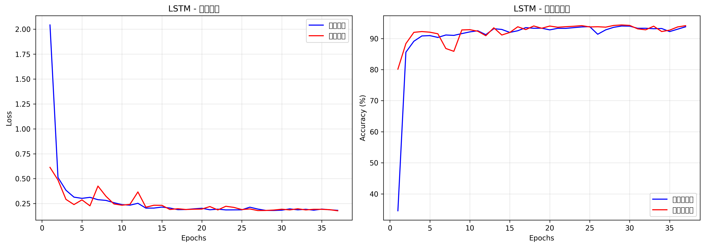

# USTC-TFC2016 网络流量分类项目

## 项目简介

本项目基于深度学习方法对USTC-TFC2016数据集进行网络流量分类。使用LSTM（长短期记忆网络）模型对网络流量数据进行特征提取和分类，实现了94.36%的验证准确率。项目包含了完整的数据预处理、模型训练、评估和可视化流程。

## 数据集

### USTC-TFC2016
- **来源**：中国科学技术大学发布的网络流量数据集
- **内容**：包含正常流量和多种恶意软件流量
- **原始类别**：2-19（共17个类别）
- **样本数量**：约31万条流量序列

### 数据预处理
- 序列长度：100
- 特征维度：75
- 数据分割：训练集(70%)、验证集(10%)、测试集(20%)
- 标签映射：将原始标签2-19映射为0-16

## 模型架构

### LSTM网络结构
```
输入层 (batch_size, 100, 75)
    ↓
LSTM层1 (hidden_size=256, bidirectional=False)
    ↓
Dropout层 (p=0.3)
    ↓
LSTM层2 (hidden_size=256)
    ↓
Dropout层 (p=0.3)
    ↓
全连接层 (512 → 128)
    ↓
ReLU激活
    ↓
Dropout层 (p=0.3)
    ↓
输出层 (128 → 17)
    ↓
Softmax
```

### 模型参数
- 总参数量：640,273
- 可训练参数：640,273
- 损失函数：CrossEntropyLoss（带类别权重）
- 优化器：Adam (lr=0.001)
- 批次大小：16
- 训练轮数：50（带早停机制）

## 环境要求

```bash
Python 3.8+
PyTorch 1.8+
CUDA 11.0+ (GPU训练可选)
numpy
pandas
matplotlib
scikit-learn
tqdm
```

## 项目结构

```
USTC-TFC2016_organized/
├── train1.py                 # 主训练脚本
├── README.md                  # 项目说明
├── requirements.txt           # 依赖包列表
├── preprocess1/               # 预处理数据目录
│   ├── ustc_sequences.npy    # 序列数据
│   ├── ustc_labels.npy       # 标签数据
│   └── ustc_indices.npy      # 索引数据
├── results1/                  # 结果保存目录
│   ├── best_model.pth        # 最佳模型权重
│   ├── final_model.pth       # 最终模型权重
│   ├── LSTM_training_history.png  # 训练曲线图
│   ├── confusion_matrix.png  # 混淆矩阵
│   └── classification_report.txt # 分类报告
└── logs/                      # 训练日志
```

## 安装与使用

### 1. 环境配置

```bash
# 克隆项目
git clone [项目地址]
cd USTC-TFC2016_organized

# 安装依赖
pip install -r requirements.txt
```

### 2. 数据准备

确保数据文件放在正确的位置：
```
preprocess1/
├── ustc_sequences.npy    # 形状: (n_samples, 100, 75)
├── ustc_labels.npy       # 形状: (n_samples,)
└── ustc_indices.npy      # 形状: (n_samples,)
```

### 3. 训练模型

```bash
# 基础训练
python train1.py --batch_size 16 --epochs 50

# 自定义参数训练
python train1.py --batch_size 32 --epochs 100 --lr 0.0005

# 仅测试（使用已训练好的模型）
python train1.py --test_only
```

### 4. 参数说明

| 参数 | 类型 | 默认值 | 说明 |
|------|------|--------|------|
| `--batch_size` | int | 16 | 批次大小 |
| `--epochs` | int | 50 | 训练轮数 |
| `--lr` | float | 0.001 | 学习率 |
| `--test_only` | flag | False | 仅测试模式 |
| `--no_cuda` | flag | False | 禁用GPU |

## 实验结果

### 性能指标
- **最佳验证准确率**：94.36%
- **最终测试准确率**：94.05%
- **训练时间**：约30分钟（NVIDIA RTX 4060 Laptop GPU）

### 训练曲线

训练过程中记录了损失和准确率的变化：


### 类别分布

原始数据集存在类别不平衡问题：
- 最多类别：类别2（49889样本）
- 最少类别：类别5（14样本）
- 处理方法：使用类别权重加权损失函数

## 代码特性

### 1. 内存优化
- 使用内存映射文件处理大型numpy数组
- 自定义数据集类实现按需加载

### 2. 早停机制
- patience=10轮
- 保存最佳模型权重

### 3. 可视化
- 实时显示训练进度
- 自动生成训练曲线图
- 混淆矩阵可视化

### 4. 日志记录
- 详细的训练过程记录
- 模型参数保存
- 分类报告生成

## 常见问题

### Q1: 如何处理类别不平衡？
A: 项目自动计算类别权重并应用到损失函数中，确保模型对少数类别也有良好的识别能力。

### Q2: 训练时内存不足怎么办？
A: 项目采用内存优化模式，可以减小batch_size或使用CPU模式。

### Q3: 如何在自己的数据集上使用？
A: 需要将数据预处理为相同的格式：(n_samples, sequence_length, features)的numpy数组。

## 未来改进

- [ ] 添加更多模型架构（Transformer、CNN-LSTM等）
- [ ] 实现数据增强策略
- [ ] 添加集成学习方法
- [ ] 优化少数类别的识别准确率
- [ ] 提供Web界面进行实时流量分类

## 联系方式

- 作者：丁春儒
- 邮箱：2022211636@bupt.cn
- 项目地址：https://github.com/Dingchunru

---

**注意**：本项目仅供学习和研究使用，请勿用于非法用途。
